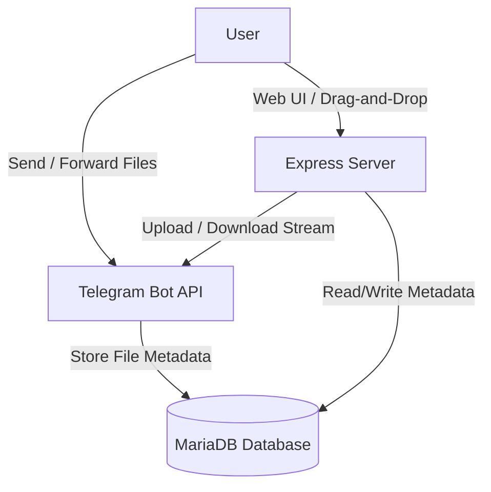

# Terra Telegram Drive 📁🤖

A personal cloud storage application powered by **Telegram Storage** and **MariaDB/MySQL**. This project allows you to use your own Telegram Bot as an unlimited cloud storage backend while organizing files, folders, and tags through a modern Web Portal dashboard.

---

## 🚀 Overview

Terra Telegram Drive bridges the gap between Telegram's generous cloud storage limits and structured local/web organization. By sending files to your custom Telegram bot, or uploading them directly via the Web Portal, files are securely stored in Telegram's cloud storage. The application maintains full metadata (filenames, sizes, folders, tags) in a local MariaDB/MySQL database.



---

## ✨ Features

- **📂 Folder Organization**: Create and manage nested directory structures for your files.
- **🏷️ Smart Tagging**: Tag files to easily group, categorize, and filter them.
- **🔍 Quick Search**: Instant client-side and database-backed searching by file name or tags.
- **🌐 Dual-Channel Uploads**:
  - **Web Portal**: Drag-and-drop file upload with progress feedback.
  - **Telegram Chat**: Send or forward files, images, videos, and documents directly to your Telegram bot.
- **🔗 Account Linking**: Deep linking authentication allows linking Telegram chat IDs to specific Web dashboard users securely.
- **⚡ On-Demand Streaming**: Files are streamed directly from Telegram servers through your bot when clicked/downloaded from the Web Portal.
- **📥 Import from Telegram**: Input any Telegram file ID or message URL to import it directly into your personal drive database.
- **🔒 Security Features**:
  - Session-based authentication.
  - CSRF protection enabled across all state-changing endpoints.
  - Strong password hashing using `bcryptjs`.
  - Auto-generating and expiring tokens for account linking.

---

## 🛠️ Prerequisites

Before you start, make sure you have the following installed:
1. **Node.js** (v20+ recommended)
2. **MariaDB** or **MySQL** server instance
3. **Telegram Bot**: Created via [@BotFather](https://t.me/BotFather) on Telegram

---

## ⚙️ Environment Configuration

Create a `.env` file in the root directory. You can use the following configuration as a reference:

```env
PORT=8038
HOST=0.0.0.0
DB_HOST=127.0.0.1
DB_PORT=3306
DB_USER=root
DB_PASSWORD=your_secure_db_password
DB_NAME=telegram_drive
TELEGRAM_BOT_TOKEN=123456789:ABCdefGhIJKlmNoPQRsTUVwxyZ
SESSION_SECRET=a_very_long_random_session_secret_string
ADMIN_PASSWORD=your_custom_admin_password
```

### Environment Variables Breakdown

| Variable | Description | Default |
| :--- | :--- | :--- |
| `PORT` | Express server port | `3000` |
| `HOST` | Host interface to bind to | `127.0.0.1` |
| `DB_HOST` | Database host IP or hostname | `10.0.3.20` |
| `DB_PORT` | Database port | `3306` |
| `DB_USER` | Database username | `root` |
| `DB_PASSWORD` | Database password | — |
| `DB_NAME` | Database schema name | `telegram_drive` |
| `TELEGRAM_BOT_TOKEN` | Telegram Bot Token from @BotFather | — |
| `SESSION_SECRET` | Secret key for Express sessions | — |
| `ADMIN_PASSWORD` | Password for the default `admin` user | `adminpass123` |

---

## 📦 Installation & Setup

1. **Clone the project & Navigate into it**:
   ```bash
   git clone <repository-url>
   cd terraTelegramDrive
   ```

2. **Install dependencies**:
   ```bash
   npm install
   ```

3. **Configure Environment**:
   Configure `.env` file as described in the Environment Configuration section.

4. **Initialize Database**:
   During the first run, the application will automatically create the database specified by `DB_NAME` (if it does not exist), execute the `schema.sql` migration, and bootstrap the default `admin` user.

---

## 🚀 Running the Application

### Development Mode (with file watcher)
Runs the server and bot with Node's native watch mode:
```bash
npm run dev
```

### Production Mode
```bash
npm start
```

---

## 🤖 Telegram Bot Commands

When interacting with your custom Telegram Bot, the following commands are available:

- `/start` - Greet the user or process the deep link authentication token to link the account.
- `/upload` - Explains how to upload files (simply drag and drop or forward messages to the bot).
- `/files` - Lists the 10 most recently uploaded/imported files.
- `/search <keyword/tag>` - Search files by file name or tags.
- `/folder <path>` - Lists files inside that folder, or moves a file to the folder if you reply to a message containing a file with this command.
- `/tag <tag1> <tag2>` - Assigns tags to a file if sent as a reply, or searches/lists tags.
- `/trash` / `/delete` - Trash a file by replying to a file message.
- `/info` - View detailed metadata of a file.
- `/storage` - Displays the total number of files and total storage utilization.

---

## 🗄️ Database Architecture

The schema comprises two tables defined in `schema.sql`:

1. **`users`**:
   - Stores account credentials, salted password hashes (`bcrypt`), and Telegram mapping attributes (`telegram_chat_id`, link token/expiration).
2. **`files`**:
   - Maintains full tracking metadata for files uploaded to Telegram. Contains mappings to Telegram's internal `telegram_file_id`, unique hash, file size, folder path, JSON tags, and deletion state.

---

## 📄 License

This project is licensed under the MIT License.
